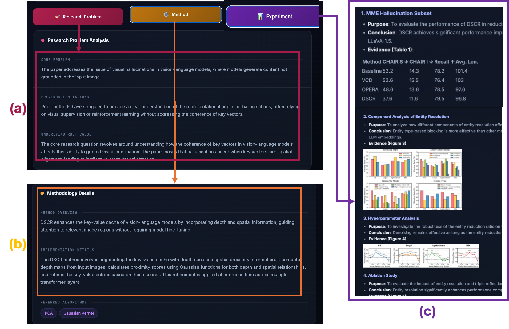
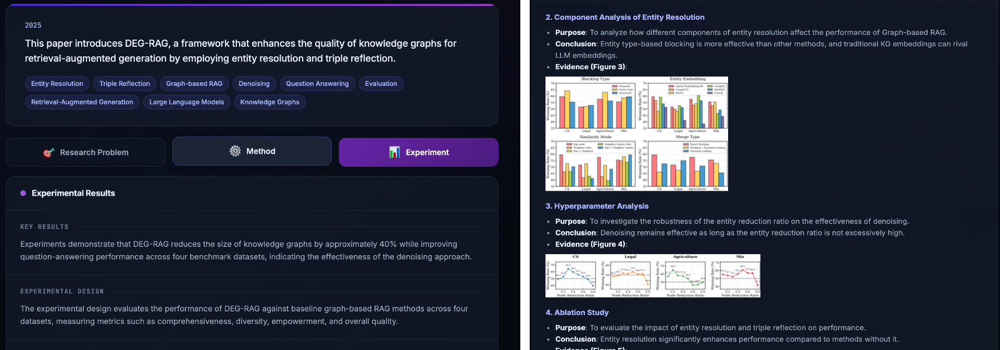
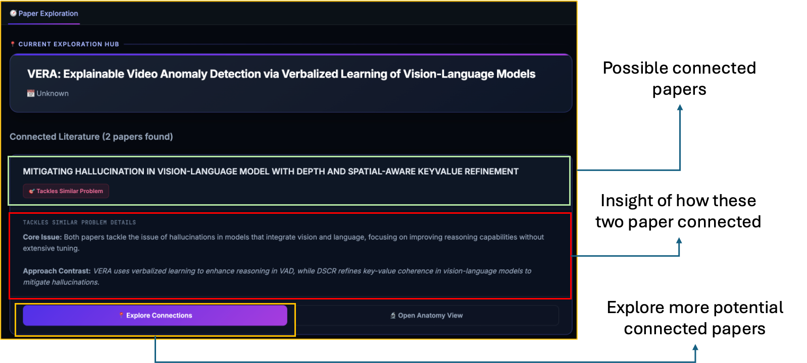

# 🕸️ LOGOS: Logic-Oriented Graph Ontology Synthesis

[](https://opensource.org/licenses/MIT)

**LOGOS** is an end-to-end agentic Knowledge Graph system explicitly tailored to the structural organization of academic research. It transforms static literature into an auditable, highly navigable cognitive map by addressing the limitations of traditional Retrieval-Augmented Generation (RAG) and generic entity extraction.

---

## ✨ Key Highlights & Features

Unlike traditional RAG systems that fragment text into isolated chunks, LOGOS preserves the structured "academic narrative" through logic-aware graph synthesis.

- **Hierarchical Paper Deconstruction (Literature Parsing Agent):** Transforms monolithic PDFs into structured, paper-centric knowledge graphs. It systematically isolates underlying problems, methodologies, experimental designs, and datasets.
- **Automated Cross-Paper Synthesis (Peer Reviewer Agent):** Connects isolated paper graphs organically. It synthesizes relations by identifying shared research bottlenecks, methodological similarities, and competitive benchmark overlaps.
- **Interactive Literature Navigation System:** A fully functional, Neo4j-backed interactive web platform enabling multiscale semantic filtering, surgical paper anatomy visualization, and automated State-of-the-Art (SOTA) trajectory mapping.

---

## 🖥️ UI Walkthrough

LOGOS provides a progressive interface for literature filtering, paper-level inspection, and cross-paper exploration.

### 1. Global Dashboard & Semantic Filtering

The global dashboard features faceted semantic filtering. Instead of manually organizing PDFs, you can filter papers using automatically generated ontology tags and quickly isolate literature relevant to a specific topic or research direction.

### 2. Paper Anatomy & Evidence Auditing

Instead of reading a PDF linearly, the anatomy view separates the paper into research problems, methods, and experiments. It attaches original figures and tables beneath extracted claims, supporting surgical evidence auditing and mitigating the risk of unsupported LLM hallucinations.

### 3. Cross-Paper Exploration & Trajectory Mapping

Driven by the Peer Reviewer Agent, this view visualizes inter-paper relations. It identifies shared research bottlenecks, generates methodological comparisons, and enables hub-and-spoke navigation across related papers to trace SOTA trajectories.

---

## 🚀 How to Use

### Prerequisites
- **Python 3.10+**
- **Neo4j** (Local instance or AuraDB)
- **OpenAI API Key** (For LLM and Embedding agents)

### Installation
1. Clone the repository:
   ```bash
   git clone https://github.com/pw-Chen-km/LOGOS.git
   cd LOGOS
   ```
2. Install dependencies (make sure to set up your environment):
   ```bash
   pip install -r requirements.txt
   ```
3. Configure your environment variables. Create a `.env` file in the root directory:
   ```env
   OPENAI_API_KEY=your_openai_api_key
   NEO4J_URI=neo4j://127.0.0.1:7687
   NEO4J_USER=neo4j
   NEO4J_PASSWORD=your_password
   ```

### 1. Ingesting Literature
To parse a paper and synthesize it into the Neo4j Knowledge Graph, use the ingestion script:
```bash
python scripts/run_phase2.py <ARXIV_PDF_URL> <OUTPUT_DIRECTORY>
```
*This will trigger the Deep-Reading Agent for document deconstruction and the Peer Reviewer Agent for cross-paper alignment.*

### 2. Running the Interactive UI
You can start the Streamlit-based interactive exploration UI:
```bash
streamlit run demo_app.py
```
*(Alternatively, explore the specialized web UI by running the server in `ui_demo/`)*

---

## 📜 Original Paper & Citation
This project is based on the research paper: **"LOGOS: Logic-Oriented Graph Ontology Synthesis for Interactive Literature Navigation"** by Pi-Wei Chen, Zih-Ching Chen, Rafał Cupek, and Jerry Chun-Wei Lin.

If you find LOGOS useful for your research, please consider citing our work.
